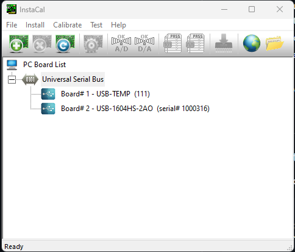

# LIF DAQ Setup

Multi-device data acquisition system for Measurement Computing DAQ boards with (WIP) real-time signal processing capabilities.

Features to Add:
-Signal processing similar to DASYLab (Simulink like, but will be slower through Python than C++)
-Merge in LabJack usage

## Supported Hardware

- **USB-1608GX-2AO**: 8 analog input channels
- **USB-1604HS-2AO**: 4 analog input channels (high-speed, up to 1.33 MHz)
- **USB-TEMP**: Thermocouple/RTD temperature measurement device (2Hz). MCC library does not do background scan for USB-TEMP so the scan is done 'like background' using a seperate processing thread.
- Other MCC DAQ devices compatible with the Universal Library

## Installation

### Prerequisites

1. **Python 3.7+** (recommended: Python 3.9 or later)
2. **InstaCal** - Measurement Computing's configuration utility
   - Download from [Measurement Computing's website](https://www.mccdaq.com/Software-Downloads)
   - Install and run to configure your DAQ boards

### Python Dependencies

Install all required packages using the requirements file:

```bash
pip install -r requirements.txt
```

This includes:
- `mcculw` - MCC Universal Library Python wrapper
- `pandas` - Data manipulation and CSV export
- `numpy` - Numerical processing

### Hardware Configuration

#### Measurement Computing Devices
**Important**: Before running the acquisition software, you must configure your DAQ boards using InstaCal.

1. **Launch InstaCal** (installed with MCC drivers)
2. **Add/Configure each DAQ device**:
   - Connect your DAQ hardware via USB
   - Click "Add Device" or use auto-detection
   - Assign a **board number** to each device (e.g., Board 0, Board 1, Board 2)
   - Test the device to ensure proper communication
3. **Note the board numbers** - these are used in configuring the DAQs in Python



#### LabJack Devices

WIP

## Usage

### Basic Acquisition

1. **Configure your DAQ setup** in `acquisition_controller.py` by editing the `main()` function:

```python
def main():
    # Create controller
    controller = AcquisitionController()
    
    # Set acquisition duration
    duration = 10.0  # seconds
    
    # Setup Board 1: USB-TEMP (temperature acquisition at 2 Hz)
    controller.setup_daq(
        board_num=1,              # Board number from InstaCal
        name="USB-TEMP",          # Descriptive name
        sample_rate=2,            # Samples per second
        low_chan=0,               # First channel
        high_chan=0,              # Last channel (0-0 = channel 0 only)
        duration_seconds=duration,
        enable_processing=False   # Disable signal processing for raw data
    )
    
    # Setup Board 2: USB-1604HS-2AO (high-speed analog at 100 kHz)
    controller.setup_daq(
        board_num=2,
        name="USB-1604HS-2AO",
        sample_rate=100000,       # 100 kHz sampling
        low_chan=0,
        high_chan=2,              # Channels 0-2 (3 channels total)
        duration_seconds=duration,
        enable_processing=True    # Enable real-time signal processing
    )
    
    # Start acquisition on all configured DAQs
    controller.start_acquisition(duration_seconds=duration)
```

2. **Run the acquisition**:

```bash
python acquisition_controller.py
```

3. **Data output**: Results are saved in timestamped folders:
```
data/
  └── 2026-02-06_11-09-26/
      ├── Board1_USB-TEMP.csv
      └── Board2_USB-1604HS-2AO.csv
```

### Signal Processing

WIP

### Performance Benchmarking

Note: Data can be lost during DAQ scans/reads due to PC processing speed. Benchmarking will help understand % data lost at higher sampling rates. Also note that Python is much slower than using C/C++ based software. TBD how Python signal processing at high speed compares with DASYLab.

Test your system's maximum acquisition rate:

```bash
python utils/benchmark_daq_performance.py
```

This runs tests from 1 kHz to 1.33 MHz and reports data loss percentages.

## Project Structure

```
lif_daq_setup/
├── acquisition_controller.py    # Main acquisition orchestrator
├── device_manager.py             # Device lifecycle management
├── signal_processor.py           # Real-time signal processing
├── config.py                     # Configuration settings
├── hardware/
│   ├── mcc_device.py            # Analog input device class
│   └── mcc_temperature_device.py # Temperature device class
├── utils/
│   ├── setup_mcc_path.py        # MCC DLL path configuration
│   ├── logging_setup.py         # Logging configuration
│   └── benchmark_daq_performance.py # Performance testing
├── data/                         # Output directory for CSV files
└── references/                   # Example code and documentation
```

## Configuration

Edit `config.py` to customize:
- Data output folder location
- Logging level and file output
- Device-specific settings

## Troubleshooting

### "Board not found" errors
- Ensure InstaCal shows the device as connected and functional
- Verify the `board_num` matches the number assigned in InstaCal
- Check USB connections and drivers

### Data loss at high sample rates
- Reduce sample rate or number of channels
- Run the benchmark tool to find your system's maximum capability
- Ensure no other CPU-intensive programs are running
- Consider using a faster PC or reducing signal processing overhead

### Temperature device issues
- USB-TEMP only supports software-based scanning (not hardware background scan)
- Keep sample rates low (typically 1-10 Hz) for temperature measurements
- Verify thermocouple type matches configuration in InstaCal

### Signal processing slowing acquisition
- Set `enable_processing=False` for high-speed acquisitions (>100 kHz)
- Optimize processing code in `signal_processor.py` using NumPy vectorization
- Reduce batch processing complexity for real-time performance

## Performance Notes

Based on benchmarking with USB-1604HS-2AO:
- **1-50 kHz**: Excellent performance (>98% data capture)
- **100 kHz**: Very good performance (~99.4% data capture)
- **>250 kHz**: Actual rate plateaus at ~175 kHz due to USB/hardware limitations
- **With signal processing**: Recommended maximum 100 kHz

## License

This project uses the MCC Universal Library, which requires appropriate licensing from Measurement Computing.

## Support

For DAQ hardware issues, consult Measurement Computing documentation and support.
